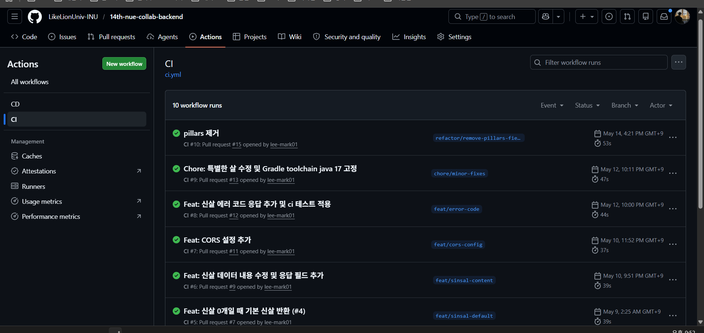
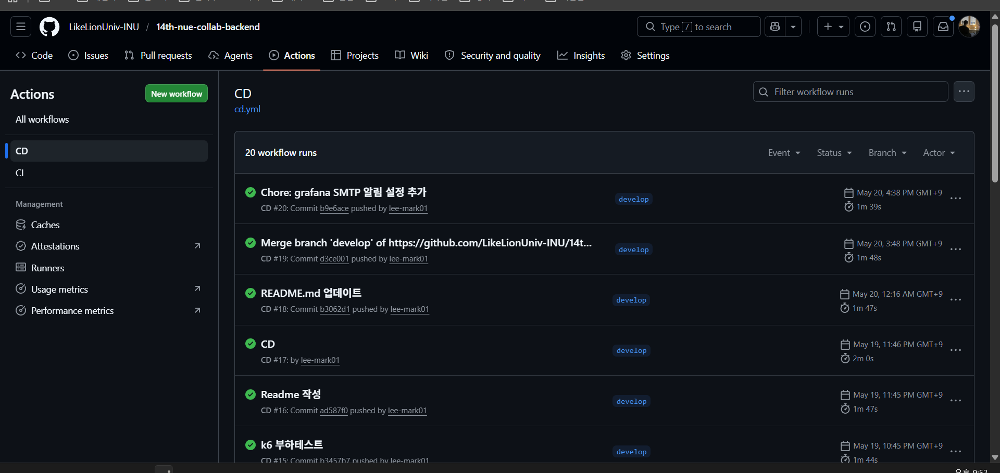
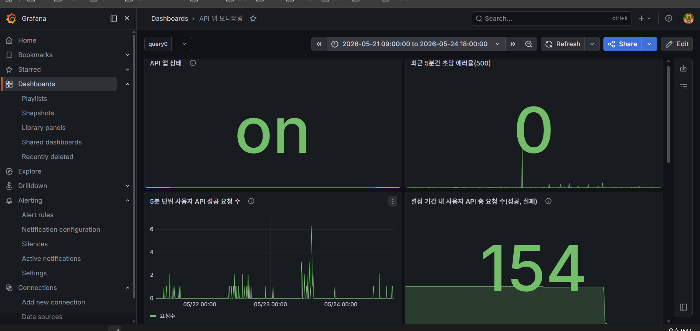
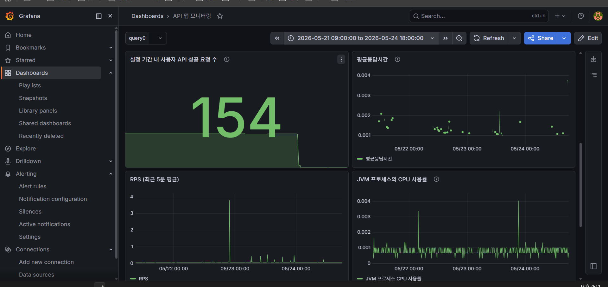
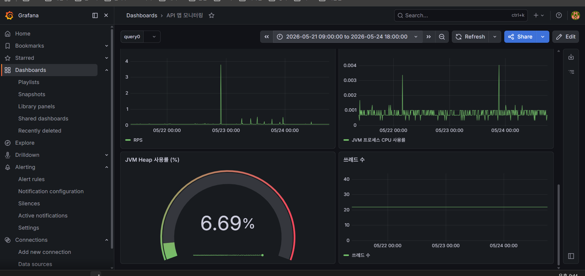
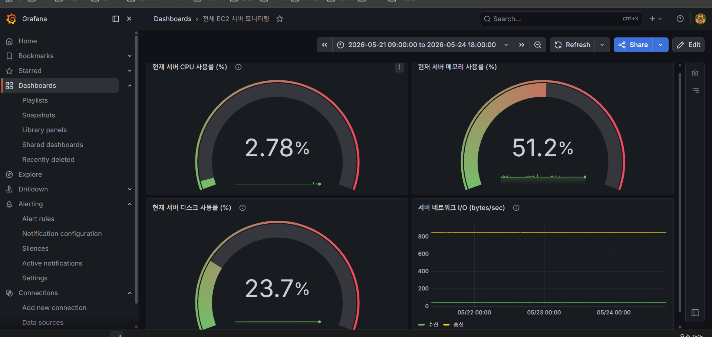
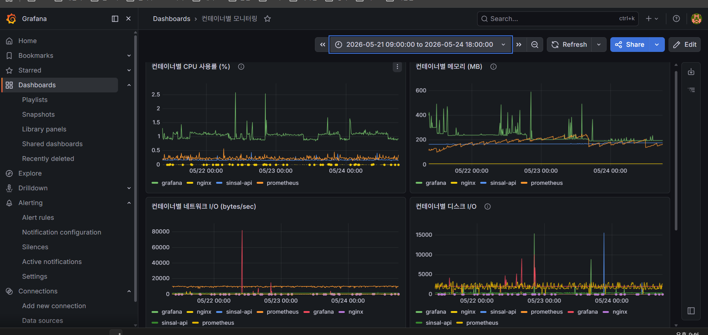
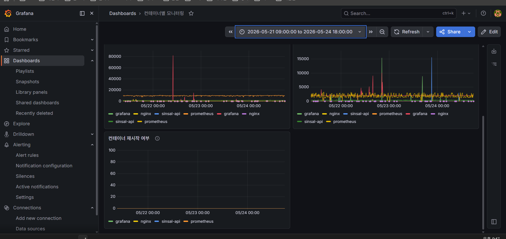
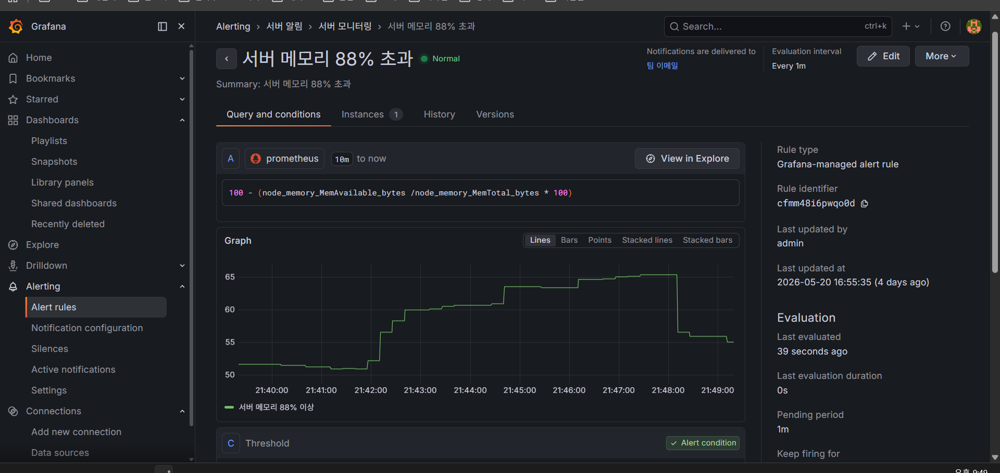
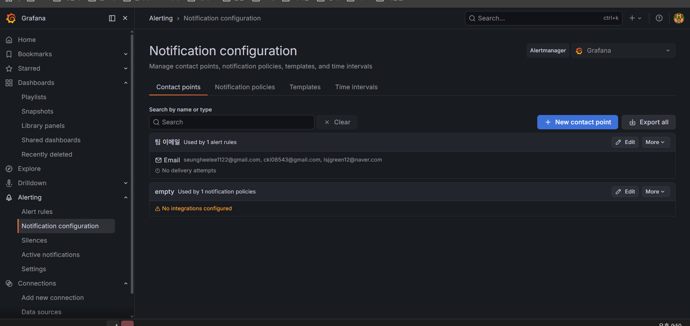

# 신살 분석 API — 사주 기반 신살 탐지 REST API

> PlayX4 게임 전시회(2026.05.21~24, 킨텍스) 출품작
> **4일간 144명 대상 무장애 운영** | 에러율 0% | 평균 응답시간 2ms


---

## 프로젝트 소개

멋쟁이사자처럼 인천대 14기 팀 프로젝트로, 생년월일을 입력하면 사주의 천간·지지 관계를 분석하여 15종의 신살을 탐지하는 REST API입니다.

PlayX4 게임 전시회에 출품하여 4일간 실사용자 144명을 대상으로 서비스를 운영했습니다.

- **프론트엔드 레포**: [14th-nue-collab-frontend](https://github.com/LikeLionUniv-INU/14th-nue-collab-frontend)

### 서비스 데모

https://github.com/user-attachments/assets/7a1f6e59-d19e-46dd-8968-863e3415f1b3

---

## 내가 맡은 역할

| 영역 | 내용 |
|------|------|
| API 설계·구현 | 신살 분석 로직, 에러 처리, API 문서화(Swagger) |
| 인프라 구축 | AWS EC2 + Docker Compose + Nginx(HTTPS) 배포 환경 |
| CI/CD | GitHub Actions로 PR 시 자동 테스트, develop push 시 ECR → EC2 자동 배포 |
| 모니터링 | Prometheus + Grafana 대시보드 3개 구성, 메모리 임계치 알림 |
| 부하 테스트 | k6로 Stress/Spike 테스트 수행, 병목 분석 |
| 전시 운영 | 4일간 무장애 운영, 장애 대응 런북 작성 |

---

## 기술적 의사결정

### DB 없이 설계한 이유

신살 분석은 생년월일 → 천간·지지 계산 → 신살 판별의 **순수 계산 로직**입니다. 조회할 데이터가 없기 때문에 DB를 도입하면 불필요한 복잡도만 증가합니다. Stateless 구조 덕분에 수평 확장도 자유롭습니다.

### 서비스·모니터링을 한 서버에 구성한 이유

전시 기간이 4일, 서버 예산이 EC2 t3.small 1대로 제한된 상황이었습니다. 서버를 분리하면 비용과 관리 복잡도가 증가하는 반면, 예상 트래픽(동시 20명)은 단일 서버로 충분히 처리 가능했습니다.

대신 **장애 시 모니터링 컨테이너부터 내리는 우선순위 런북**을 작성하여 리스크를 관리했습니다:
1. Grafana 중지 (메모리 400~600MB 확보)
2. Prometheus 중지 (추가 확보)
3. 그래도 안 되면 API 컨테이너 재시작

### 메모리 알림 임계치를 88%로 설정한 근거

부하 테스트에서 서버 메모리가 최대 86%까지 올라간 것을 확인했습니다. 88%는 "정상 피크를 넘어선 시점"을 감지하면서도 오탐(false positive)을 방지하는 지점으로, 팀원 3명에게 이메일 알림이 발송되도록 설정했습니다.

---

## 아키텍처


| 컨테이너 | 역할 |
|---------|------|
| sinsal-api | Spring Boot API 서버 |
| nginx | 리버스 프록시, HTTPS 종료 |
| prometheus | 메트릭 수집 |
| grafana | 모니터링 대시보드 |
| node-exporter | 서버 메트릭 |
| cadvisor | 컨테이너 메트릭 |

---

## CI/CD 파이프라인


- **CI**: PR 생성 시 `./gradlew build` (빌드 + 단위 테스트) 자동 실행
- **CD**: develop push 시 Docker 이미지 빌드 → ECR push → EC2 SSH 배포

전시 기간 동안 CD 파이프라인을 통해 총 20회 배포, 전부 성공했습니다.

<details>
<summary>CI/CD 실행 내역 스크린샷</summary>



</details>

---

## 모니터링 & 알림

Prometheus + Grafana로 3개 대시보드를 구성하고, 임계치 초과 시 팀 이메일로 알림이 발송되도록 설정했습니다.

### API 앱 모니터링
앱 상태(on/off), 에러율, RPS, 총 요청 수, 평균 응답시간, JVM Heap/CPU/쓰레드





### EC2 서버 모니터링
CPU/메모리/디스크 사용률, 네트워크 I/O



### 컨테이너별 모니터링
컨테이너별 CPU/메모리/네트워크/디스크 I/O, 재시작 여부




### 알림 설정
서버 메모리 88% 초과 시 팀원 3명에게 이메일 알림 발송 (1분 주기 평가)




---

## 부하 테스트 & 트러블슈팅

k6로 전시 예상 트래픽(동시 20명)의 **10배 수준**까지 테스트했습니다.

### Stress Test — 200명 점진적 부하 (27분)

| 지표 | 결과 |
|------|------|
| 총 요청 | 197,753건 |
| 에러율 | **0%** |
| 평균 응답시간 | 16ms |
| P95 응답시간 | 26ms |
| 서버 메모리 (피크) | 86% |

### Spike Test — 200명 순간 폭주 (2분 20초)

| 지표 | 결과 |
|------|------|
| 총 요청 | 13,887건 |
| 에러율 | **0%** |
| 평균 응답시간 | 15ms |
| P95 응답시간 | 23ms |

### 트러블슈팅: 메모리 86%의 원인

부하 테스트 중 서버 메모리가 86%까지 상승했습니다. 컨테이너별 모니터링으로 원인을 분석한 결과:

- **sinsal-api**: 200MB로 안정 (JVM Heap 4~9%)
- **Grafana**: 400~600MB로 메모리의 주범

API 서버 자체에는 메모리 누수가 없었고, 부하 중 Prometheus 쿼리량 증가로 Grafana 메모리가 상승한 것이 원인이었습니다. 이를 바탕으로 장애 시 Grafana → Prometheus → API 순으로 중지하는 런북을 작성했습니다.

---

## 전시 운영 결과

PlayX4 게임 전시회(킨텍스)에서 4일간 운영한 실제 결과입니다.

| 일차 | 날짜 | 참여자 수 |
|------|------|----------|
| 1일차 | 05/21 | 26명 |
| 2일차 | 05/22 | 36명 |
| 3일차 | 05/23 | 69명 |
| 4일차 | 05/24 | 13명 |
| **합계** | | **144명** |

- 전체 기간 동안 **서버 장애 0건, 에러율 0%**
- Grafana에서 확인한 총 API 호출: 154건 (사용자당 평균 1.07회)

---

## 로컬 실행

```bash
# 빌드 및 실행
./gradlew bootRun

# API 확인
curl "http://localhost:8080/api/sinsals?birthDate=2002-04-12"

# Docker 실행 (모니터링 포함)
docker compose up -d
```

API 문서: Swagger UI (`/swagger-ui/index.html`)

---

## 팀 구성

이 프로젝트는 멋쟁이사자처럼 인천대 14기 **누에고치** 팀에서 개발했습니다.

- **백엔드**: 이승희, 이서진, 정지인(멘토)
- **프론트엔드**: 이태랑, 윤서진, 성채영, 임상현(멘토)
- **원본 레포**: [LikeLionUniv-INU/14th-nue-collab-backend](https://github.com/LikeLionUniv-INU/14th-nue-collab-backend)
